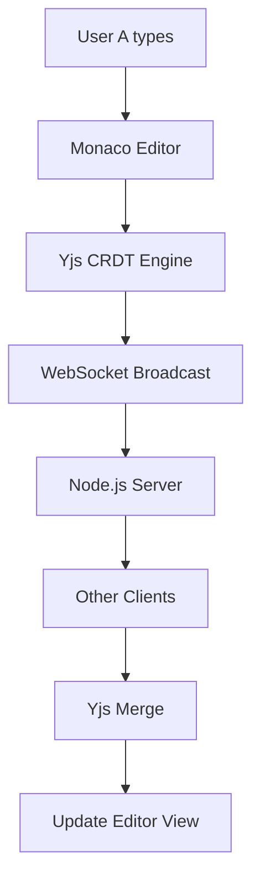

# 🚀 CollabCode

**CollabCode** is a high-performance, real-time collaborative code editor designed for teams to code together seamlessly from anywhere in the world.

## ⚙️ Working Mechanism

CollabCode uses a combination of **CRDTs** and **WebSockets** to ensure seamless synchronization.

### Data Flow
1. **The Editor (Monaco):** Captures user input and triggers events.
2. **The Brain (Yjs):** Converts edits into conflict-free operations (CRDTs).
3. **The Transport (WebSockets):** Broadcasts these operations to all connected peers via a Node.js server.
4. **The Merge:** Every client receives the operation and merges it locally, ensuring the document state is identical for everyone.



## 👥 The Team
*   **Vinay Kumar** ([@Vinay50029](https://github.com/Vinay50029))
*   **Mohan Sai** ([@mohansai1732](https://github.com/mohansai1732))
*   **Ashish** ([@Ashish-altf6](https://github.com/Ashish-altf6))

## ✨ Key Features
*   **Real-Time Collaboration:** Multiple users can edit the same file simultaneously with zero latency.
*   **Concurrent Editing:** Powered by CRDTs (Conflict-free Replicated Data Types) to ensure code consistency.
*   **Live WebSockets:** Instant synchronization across all connected clients.
*   **Syntax Highlighting:** Support for multiple programming languages.
*   **Presence Indicators:** See who else is online and what they are working on.

## 🛠️ Technology Stack
*   **Frontend:** React.js, Monaco Editor (VS Code's Engine)
*   **Backend:** Node.js, Express
*   **Real-Time:** Socket.io / WebSockets
*   **State Sync:** Yjs (CRDT implementation)
*   **Styling:** Modern Vanilla CSS / Glassmorphism

## 🚀 Getting Started

### 1. Clone the repository
```bash
git clone https://github.com/Vinay50029/CollabCode.git
```

### 2. Install Dependencies
```bash
npm install
```

### 3. Run the project
```bash
npm run dev
```

---
*Created with ❤️ by the CollabCode Team.*
